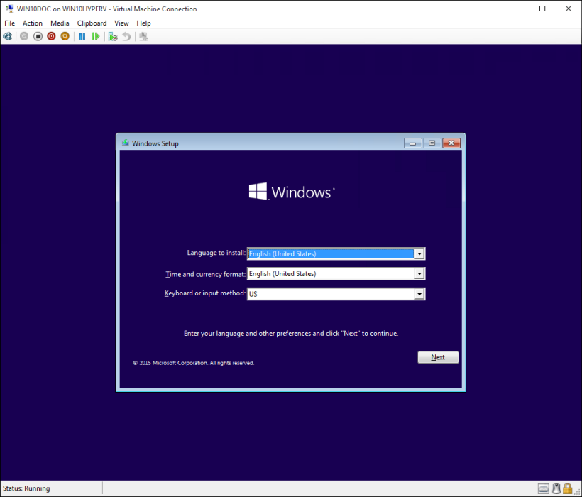

# Create a Virtual Machine with Hyper-V

Create a virtual machine and install it's operating system.  

You will need an .iso file for the operating system that you would like to run. If you don't have one on hand, grab an evaluation copy of Windows 10 from the [TechNet Evaluation Center](http://www.microsoft.com/en-us/evalcenter/).

Let's get started.

1. **Open Hyper-V Manager**  
  Either press the Window's key and type "Hyper-V Manager" to search applications for Hyper-V Manager or scroll through the applications in your start menu until you find **Hyper-V Manager**.

2. **Open Quick Create**  
  In Hyper-V Manager, click **Action** > **Quick Create** to bring up the Quick Create dialogue.

3. Give the virtual machine a name.
  > **Note:** This is the name Hyper-V uses for the virtual machine, not the computer name given to the guest operating system that will be deployed inside the virtual machine.
 
4. Select the installation media for the virtual machine. You can install from a .iso or .vhdx file.

5. If you are installing Windows in the virtual machine, you should enable Windows Secure Boot. Otherwise leave it unselected

6. Set up network. If you have an existing virtual switch, you can select in the network dropdown. If you have no existing switch, you will see a button to set up an automatic network, which will automatically configure an external switch.
 
The virtual machine will be created with a default configuration. Once it's created, you can open the virtual machine settings to see and change the configuration.
 
## Complete the Operating System Deployment

In order to finish building your virtual machine, you need to start the virtual machine and walk through the operating system installation.

1. In Hyper-V Manager, double-click on the virtual machine. This launches the VMConnect tool.

2. In VMConnect, click on the green Start button. This is like pressing the power button on a physical computer. You may be prompted to ‘Press any key to boot from CD or DVD’. Go ahead and do so.
  > **Note:** You may need to click inside the VMConnect window to ensure that your keystrokes are sent to the virtual machine.

3. The virtual machine boots into setup and you can walk through the installation like you would on a physical computer.

   
  

> **Note:** Unless you're running a volume-licensed version of Windows, you need a separate license for Windows running inside a virtual machine. The virtual machine's operating system is independent of the host operating system.

## Next Step - Work with PowerShell and Hyper-V
[Hyper-V and Windows PowerShell](try-hyper-v-powershell.md)
