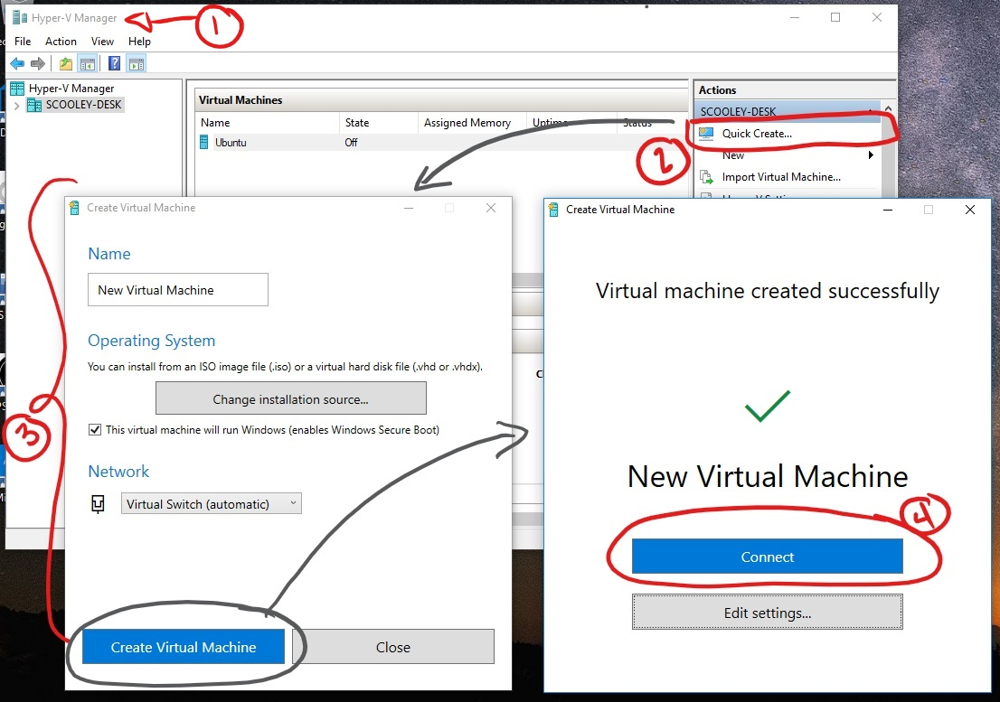

# Create a Virtual Machine with Hyper-V

Create a virtual machine and install it's operating system.  

You will need an .iso file for the operating system that you would like to run. If you don't have one on hand, grab an evaluation copy of Windows from the [TechNet Evaluation Center](http://www.microsoft.com/en-us/evalcenter/).

> Windows 10 Creators Update introduced a new **Quick Create** tool to streamline building new virtual machines.  
  If you aren't running Windows 10 Creators Update or later, follow these instructions using New-VM Wizard instead:  
  [Create a new virtual machine](create-virtual-machine.md)  
  [Create a virtual network](connect-to-network.md)

Let's get started.

1. **Open Hyper-V Manager**  
  Either press the Window's key and type "Hyper-V Manager" to search applications for Hyper-V Manager or scroll through the applications in your start menu until you find Hyper-V Manager.

2. **Open Quick Create**  
  In Hyper-V Manager, Find **Quick Create** in the right hand **Actions** menu.

3. **Customize your virtual machine**
  * (optional) Give the virtual machine a name.  
    This is the name Hyper-V uses for the virtual machine, not the computer name given to the guest operating system that will be deployed inside the virtual machine.
  * Select the installation media for the virtual machine. You can install from a .iso or .vhdx file.  
    If you are installing Windows in the virtual machine, you can enable Windows Secure Boot. Otherwise leave it unselected.
  * Set up network.  
    If you have an existing virtual switch, you can select in the network dropdown. If you have no existing switch, you will see a button to set up an automatic network, which will automatically configure an external switch.

4. **Connect to the virtual machine**  
  Selecting **Connect** will launch Virtual Machine Connection and start your virtual machine.     
  Don't worry about editing the settings, you can go back and change them any time.  
  
    You may be prompted to ‘Press any key to boot from CD or DVD’. Go ahead and do so.  As far as it knows, you're installing from a CD.

Congratulations, you have a new virtual machine.  Now you're ready to install the operating system.  

Your virtual machine should look something like this:  
 

> **Note:** Unless you're running a volume-licensed version of Windows, you need a separate license for Windows running inside a virtual machine. The virtual machine's operating system is independent of the host operating system.
