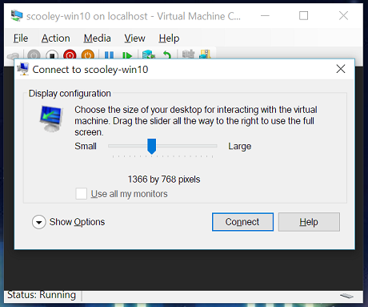
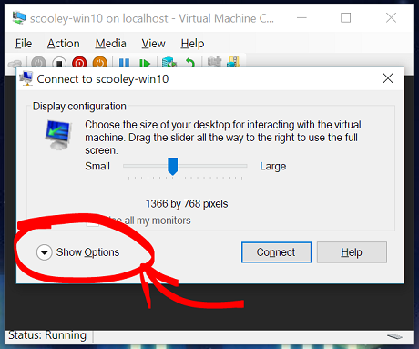
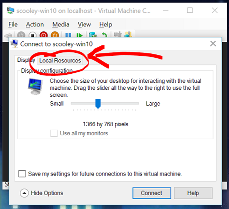
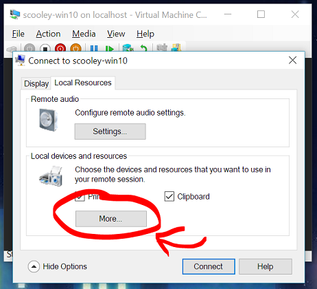
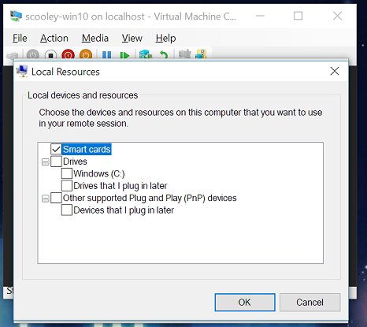
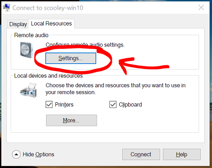
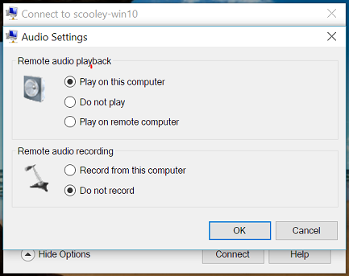

# Share devices with your virtual machine

Enhanced Session Mode lets Hyper-V share devices with your virtual machines and improves the general virtual machine viewing experience.  Since it's on by default in Windows 10, you've probably been using it without knowing.

> Enhanced Session Mode is only available for Windows virtual machines.

Advantages of enhanced session mode:

* Makes virtual machines resizeable and high DPI aware.
* Improves virtual machine integration
  * shared clipboard
  * file sharing via drag drop and copy paste
* Allows device sharing
  * Microphone/Speakers
  * most USB devices
  * Data disks (including C:)
  * Printersr

This article shows you how to see your session type, enter enhanced session mode, and configure your session settings.

## Share drives and devices

All of Enhanced Session Mode's device sharing capabilities are hidden inside this inconspicuous connection window that pops up when you connect to a virtual machine:

By default, virtual machines using enhanced session mode will share clipboard and printers.  They are also configured by default to pass audio from the virtual machine back to your computer's speakers.

To share devices with your virtual machine or to change those default settings:

1. Show more options

  

1. View local resources

  

### Share storage and USB devices

By default, virtual machines using enhanced session mode share printers, the clipboard,  pass smartcard and other security devices through to the virtual machine so you can use more secure login tools from your virtual machine.

To share other devices, such as USB devices or your C: drive, select the "More..." menu:  

From there you can select the devices you'd like to share with the virtual machine.  The system drive (Windows C:) is especially helpful for file sharing.  

### Share audio devices (speakers and microphones)

By default, virtual machines using enhanced session mode pass audio through so you can hear  audio from the virtual machine.  The virtual machine will use the audio device currently selected on the host machine.

To change those settings or to add microphone passthrough (so you can record audio in a virtual machine):

Select the "Settings..." menu for configuring remote audio settings

Now configure audio and microphone settings

Since your virtual machine is probably running locally, the "play on this computer" and "play on remote computer" options will yield the same results.

## Re-launching the connection settings

## Check session type

