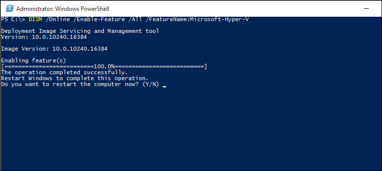

ms.ContentId: A6DD6776-614C-4D28-9B83-CB2EDFD263A3
title: Step 2 - Install Hyper-V on Windows 10

# Install Hyper-V on Windows 10

You must enable the Hyper-V role before you can create virtual machines on Windows 10. This can be done using the Windows 10 control panel, PowerShell or the Deployment Imaging Servicing and Management tool (DISM). This documents walks through each of these.

> Before enabling Hyper-V, make sure your system is compatible. For more information, see [Windows 10 Hyper-V System Requirements](https://msdn.microsoft.com/virtualization/hyperv_on_windows/quick_start/walkthrough_compatibility).

## Manually Install the Hyper-V role

1. Right click on the Windows button and select ‘Programs and Features’.

2. Select **Turn Windows Features on or off**.

3. Select **Hyper-V** and click **OK**.  


When the installation has completed you are prompted to restart your computer.


## Install Hyper-V with PowerShell

1. Open a PowerShell console as Administrator.

2. Run the following command:

```powershell
Enable-WindowsOptionalFeature -Online -FeatureName Microsoft-Hyper-V –All
```
When the installation has completed you need to reboot the computer.

## Install Hyper-V with DISM

The Deployment Image Servicing and Management tool or DISM is used to service Windows images and prepare Windows Pre installation environments. DISM can also be used to enable Windows features while the operating system is running. For more information, see [DISM Technical Reference](https://technet.microsoft.com/en-us/library/hh824821.aspx).

To enable the Hyper-V role using DISM:

1. Open up a PowerShell or CMD session as Administrator.

2. Type the following command:

```powershell
DISM /Online /Enable-Feature /All /FeatureName:Microsoft-Hyper-V
```



## Next Step - Create a Virtual Switch
[Create a Virtual Switch](walkthrough_virtual_switch.md) 