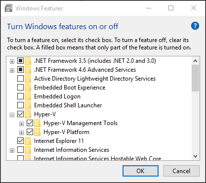
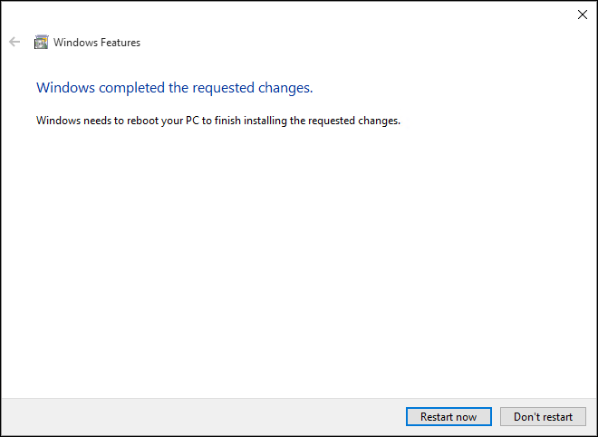

ms.ContentId: A6DD6776-614C-4D28-9B83-CB2EDFD263A3
title: Step 2: Install Hyper-V on Windows 10

# Step 2: Install Hyper-V on Windows 10

Before you can begin using virtual machines on Windows 10 you will need to enable the Hyper-V role. This can be done using the Windows 10 graphical user interface, PowerShell or DISM. This documents will walk through each of these.

## Enabling Hyper-V Through the GUI

- Right click on the start button and select ‘Programs and Features’.
- Select ‘Turn Windows Features on or off’.
- Select ‘Hyper-V’ and click ‘OK’.



When the installation has completed you will be prompted to restart your computer.



## Enabling Hyper-V with PowerShell

- Open a PowerShell console by clicking on the start button, typing PowerShell, right clicking on the program and selecting ‘Run as Administrator’.
- Enter the following command to enable the Hyper-V role:

```powershell
Enable-WindowsOptionalFeature -Online -FeatureName Microsoft-Hyper-V –All```

- When the installation has completed you will need to reboot the computer.

## Enabling Hyper-V with DISM.

The Deployment Image Servicing and Management tool or DISM is used to service Windows images and prepare Windows Pre installation Evironments. DISM can also be used to enable Windows features in running instances of the OS.

To enable the Hyper-V role using DISM:

- Open up a PowerShell or CMD session as Administrator.
- Type the following command:
```DISM /Online /Enable-Feature /All /FeatureName:Microsoft-Hyper-V```
- Once completed you will be prompted to reboot.


## Next Step 
[Step 3: Create a virtual switch](walkthrough_virtual_switch.md) 