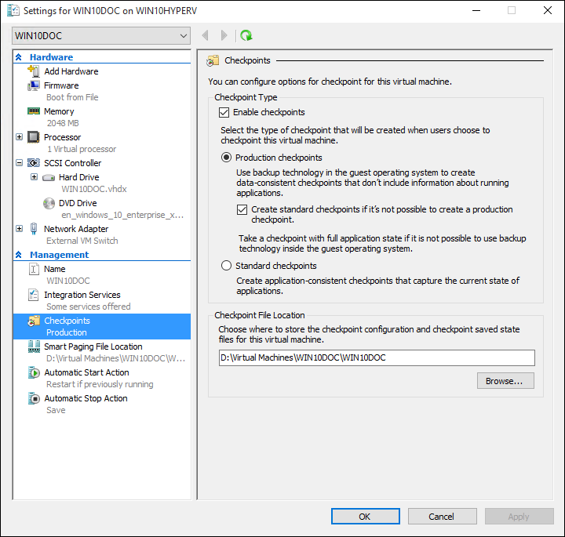
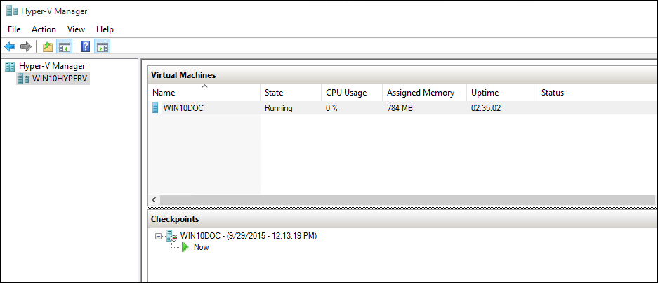

# Using checkpoints to revert virtual machines to a previous state

One of the great benefits to virtualization is the ability to easily save the state of a virtual machine. In Hyper-V this is done through the use of virtual machine checkpoints. You may want to create a virtual machine checkpoint before making software configuration changes, applying a software update, or installing new software. If a system change were to cause an issue, the virtual machine can be reverted to the state at which it was when then checkpoint was taken.

Windows 10 Hyper-V includes two types of checkpoints:

* **Standard Checkpoints** -- takes a snapshot of the virtual machine and virtual machine memory state at the time the checkpoint is initiated. A snapshot is not a full backup and can cause data consistancy issues with systems that replicate data between different nodes such as Active Directory.  Hyper-V only offered standard checkpoints (formerly called snapshots) prior to Windows 10.

* **Production Checkpoints** –- uses Volume Shadow Copy Service or File System Freeze on a Linux virtual machine to create a data conistenant back of the virtual machine.

Production checkpoints are selected by default however this can be changed using either Hyper-V manager or PowerShell.

> **Note:** The Hyper-V PowerShell module has several aliases so that checkpoint and snapshot can be used interchangeably.  
  This document uses checkpoint, however be aware that you may see similar command using the term snapshot.

## Changing the Checkpoint Type

### Using Hyper-V Manager

1. Open Hyper-V Manager.

2. Right click on a virtual machine and select **settings**.

3. Under Management select **Checkpoints**.

4. Select the desired checkpoint type.



### Using PowerShell

The following commands can be run to change the checkpoint with PowerShell. 

Set to Standard Checkpoint:
```powershell
Set-VM -Name <vmname> -CheckpointType Standard
```

Set to Production Checkpoint, if the production checkpoint fails a standard checkpoint is be created:
```powershell
Set-VM -Name <vmname> -CheckpointType Production
```

Set to Production Checkpoint, if the production checkpoint fails a standard checkpoint is not be created. 
```powershell
Set-VM -Name <vmname> -CheckpointType ProductionOnly
```

## Creating checkpoints
Creates a checkpoint of the type configured for the virtual machine. See the [Configuring Checkpoint Type](checkpoints.md#changing-the-checkpoint-type-for-a-VM) section earlier in this document for instructions on how to change this type.

### Using Hyper-V Manager

To create a checkpoint:  
1. In Hyper-V Manager, select the virtual machine.
2. Right-click the name of the virtual machine, and then click **Checkpoint**.
3. When the process is complete, the checkpoint will appear under **Checkpoints** in the **Hyper-V Manager**.

### Using PowerShell

Create a checkpoint using the **CheckPoint-VM** command.  

```powershell
Checkpoint-VM –Name <VMName>
```

When the checkpoint process has completed, view a list of checkpoints for a virtual machine use the **Get-VMCheckpoint** command.

```powershell
Get-VMCheckpoint -VMName <VMName>
```

## Applying checkpoints
If you want to revert your virtual machine to a previous point-in-time, you can apply an existing checkpoint.

### Using Hyper-V Manager

1.	In **Hyper-V Manager**, under **Virtual Machines**, select the virtual machine.
2.	In the Checkpoints section, right-click the checkpoint that you want to use and click **Apply**.
3.	A dialog box appears with the following options:  
  * **Create Checkpoint and Apply**: Creates a new checkpoint of the virtual machine before it applies the earlier checkpoint. 
  * **Apply**: Applies only the checkpoint that you have chosen. You cannot undo this action.
  * **Cancel**: Closes the dialog box without doing anything.
  
  Select either Apply option to create apply the checkpoint.

### Using PowerShell

5. To see a list of checkpoints for a virtual machine use the **Get-VMCheckpoint** command.

	```powershell
	Get-VMCheckpoint -VMName <VMName>
	```
6. To apply the checkpoint use the **Restore-VMCheckpoint** command.

	```powershell
	Restore-VMCheckpoint -Name <checkpoint name> -VMName <VMName> -Confirm:$false
	```

## Renaming checkpoints
Many checkpoints are created at a specific point.  Giving them an identifyable name makes it easier to remember details about the system state when the checkpoint was created.

By default, the name of a checkpoint is the name of the virtual machine combined with the date and time the checkpoint was taken. This is the standard format: 

```
virtual_machine_name (MM/DD/YYY –hh:mm:ss AM\PM)
```

Names are limited to 100 characters or less, and the name cannot be blank. 

### Using Hyper-V Manager
1.	In **Hyper-V Manager**, select the virtual machine.
2.	Right-click the checkpoint, and then select **Rename**.
3.	Enter in the new name for the checkpoint. It must be less than 100 characters, and the field cannot be empty.
4.	Click **ENTER** when you are done.

### Using PowerShell

``` powershell
Rename-VMCheckpoint –VMName <virtual machine name> –Name <checkpoint name> --NewName <new checkpoint name>
```

## Deleting checkpoints
Deleting checkpoints can help create space on your Hyper-V host.

Behind the scenes, checkpoints are stored as .avhdx files in the same location as the .vhdx files for the virtual machine. When you delete a checkpoint, Hyper-V merges the .avhdx and .vhdx files for you.  Once completed, the checkpoint's .avhdx file will be deleted from the file system. 

You should not delete the .avhdx files directly.
 
### Using Hyper-V Manager
To cleanly delete a checkpoint: 

1.	In **Hyper-V Manager**, select the virtual machine.
2.	In the **Checkpoints** section, right-click the checkpoint that you want to delete, and click Delete. You can also delete a checkpoint and all subsequent checkpoints. To do so, right-click the earliest checkpoint that you want to delete, and then click ****Delete Checkpoint** Subtree**.
3.	You might be asked to verify that you want to delete the checkpoint. Confirm that it is the correct checkpoint, and then click **Delete**. 
 
### Using PowerShell
```powershell
Remove-VMCheckpoint –VMName <virtual machine name> –Name <checkpoint name>
```

## Exporting checkpoints
Export bundles the checkpoint as a virtual machine so the checkpoint can be moved to a new location. Once imported, the checkpoint is restored as a virtual machine.  Exported checkpoints can be used for backup.

### Using PowerShell
``` powershell
Export-VMCheckpoint –VMName <virtual machine name>  –Name <checkpoint name> -Path <path for export>
```

## Enable or disable checkpoints

1.	In **Hyper-V Manager**, right-click the name of the virtual machine, and click **Settings**.
2.	In the **Management** section, select **Checkpoints**.
3.	To allow checkpoints to be taken off this virtual machine, make sure Enable Checkpoints is selected -- this is the default behavior.  
To disable checkpoints, deselect the **Enable Checkpoints** check box.
4.	Click **Apply** to apply your changes. If you are done, click **OK** to close the dialog box.

## Change where checkpoint settings and save state files are stored
If the virtual machine has no checkpoints, you can change where the checkpoint configuration and saved state files are stored.

1.	In **Hyper-V Manager**, right-click the name of the virtual machine, and click **Settings**.	
2.	In the **Management** section, select **Checkpoints** or **Checkpoint File Location**.	
4.	In **Checkpoint File Location**, enter the path to the folder where you would like to store the files.	
5.	Click **Apply** to apply your changes. If you are done, click **OK** to close the dialog box.

The default location for storing checkpoint configuration files is: `%systemroot%\ProgramData\Microsoft\Windows\Hyper-V\Snapshots`.


<!-- This belongs in dev docs

This folder will contain the .VMRS file with the runtime and saved state data and a .VMCX configuration file, which uses the checkpoint GUID as the file name.
-->

## Demonstrating checkpoints in Hyper-V Manager 

This exercise walks through creating and applying a standard checkpoint versus a production checkpoint.  For this example, you will make a simple change to the virtual machine and observe the different behavior. 

### Standard checkpoint

1. Log into your virtual machine and create a text file on the desktop.
2. Open the file with Notepad and enter the text ‘This is a Standard Checkpoint.’ **Do not save the file or close Notepad**.  
3. Change the checkpoint to standard -- instructions [here](checkpoints.md#changing-the-checkpoint-type-using-hyper-V-manager).
4. Create a new checkpoint.
  
   

**Apply the Standard Checkpoint with Hyper-V Manager**

Now that a checkpoint exists, make a modification to the virtual machine and then apply the checkpoint to revert the virtual machine back to the saved state. 

1. Close the text file if it is still open and delete it from the virtual machines desktop.
2. Open Hyper-V Manager, right click on the standard checkpoint, and select Apply.
3. Select Apply on the Apply Checkpoint notification window.

 

Once the checkpoint has been applied, notice that not only is the text file present, but the system is in the exact state that it was when the checkpoint was created. In this case Notepad is open and the text file loaded.

## Working with Production Checkpoints in Hyper-V Manager

Let’s now examine production checkpoints. This process is almost identical to working with a standard checkpoint, however will have slightly different results. Before beginning make sure you have a virtual machine and that you have changes the checkpoint type to Production checkpoints.

**Modify the virtual machine and Create a Production Checkpoint**

1. Log into the virtual machine and create a new text file. If you have been following along in this exercises you can use the existing text file.
2. Enter ‘This is a Production Checkpoint.’ into the text file, save the file but **do not close Notepad**.
3. Open up Hyper-V Manager > right click on the virtual machine > select **Checkpoint**.
4. Click **OK** on the Production Checkpoint Created Window.

 
	
**Apply the Production Checkpoint with Hyper-V Manager**

Now that a checkpoint exists make a modification to the system and then apply the checkpoint to revert the virtual machine back to the saved state. 

1. Close the text file if it is still open and delete it from the virtual machines desktop.
2. Open up Hyper-V Manager, right click on the production checkpoint, and select **Apply**.
3. Select **Apply** on the Apply Checkpoint notification window.

Once the production checkpoint has been applied, noticed that the virtual machine is in an off state.

1. Start and log into the virtual machine.
2. Take note that the text file has been restored. But unlike the standard checkpoint, Notepad is not open.   