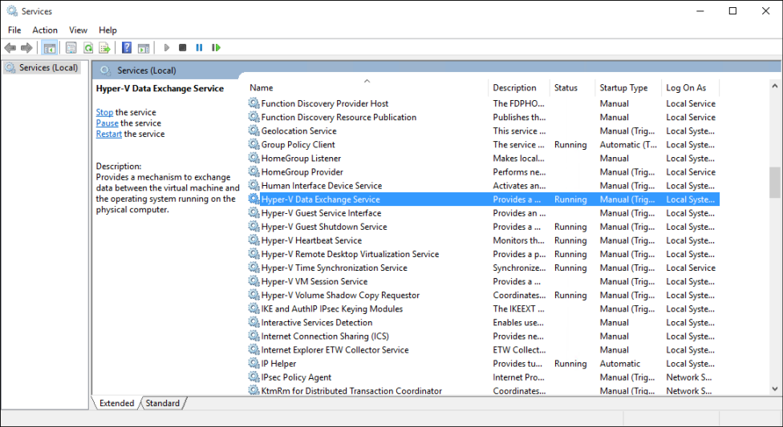

ms.ContentId: c0da5ae7-69b6-49a5-934a-6315b5538d6c
title: Managing integration services

# Managing integration service
Welcome to the in-depth reference for everything integration service related.

## Integration services and what they do
Integration services (often called integration components) are services that allow virtual machines to communicate with the Hyper-V host.  
Some of the tasks integration services provide include:
* Operating system shutdown
* Time synchronization
* Data exchange (KVP)
* Heartbeat 
* Backup (Volume Shadow Copy)
* Guest Services
  * Guest File Copy
  * PowerShell Direct

Many of these services are conviniences (such as guest services) while others can be quite important to the guest operating system's ability to fucntion correctly (time synchronization).  

The coplexity in integration service management comes from crossing the guest to host boundary.  Since they span the Hyper-V host and the guest operating systems that run on it, some management actions require Hyper-V Administrator permissions on the host, others require Administrator credentials in the guest.  Integration services also have different availability and behavior depeding on the guest and host operating systems.

Integration services have also changed with time.  The services available and deployment mechanisms have also changed.  As such, installing, updating, and enabling/disabling integration services can be difficult to understand.  This article aims to demystify the 

Some operating systems have the integration services built-in, while others provide integration services through Windows Update.

## What is "up to date" for integration services

## Enable or disable integration services from the Hyper-V host

### Managing integration services with Hyper-V Manager

### Managing integration services with PowerShell

IC Version is deprecated in Windows 10 and Server 16.

## Disable integration services from the guest operating system
 

## Getting integration services

## Install integration components on offline virtual machines

