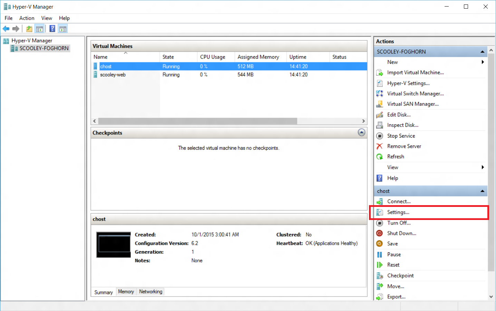
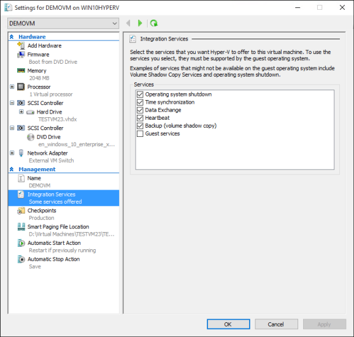

ms.ContentId: c0da5ae7-69b6-49a5-934a-6315b5538d6c
title: Managing integration services

# Managing integration service
Welcome to the in-depth reference for everything integration service related.

## Integration services and what they do
Integration services (often called integration components) are services that allow the virtual machine to communicate with the Hyper-V host.

Many of these services are conveniences (such as guest file copy) while others can be quite important to the guest operating system's ability to function correctly (time synchronization).

This article aims to demystify the finer points of managing integration services on any supported Hyper-V environment.

## Integration service management

### Enable or disable integration services from the Hyper-V host

To enable or disable integration services using Hyper-V Manager:

1. select a virtual machine and open settings.
  
  
2. From the virtual machine settings window, go to the Integration Services tab under Management.
  
  
  Here you can see all integration services available on this Hyper-V host.  It's worth noting that the guest operating system may or may not support all of the integration services listed.

Integration services can also be enabled and disabled with PowerShell by running [`Enable-VMIntegrationService`](https://technet.microsoft.com/en-us/library/hh848500.aspx) and [`Disable-VMIntegrationService`](https://technet.microsoft.com/en-us/library/hh848488.aspx).

In this example, we'll enable and then disable the guest file copy integration service on the "chost" virtual machine seen above.

1. See what integration services are running
  
  ``` PowerShell
  Get-VMIntegrationService -VMName "chost"
  ```

  The output will look like this:  
  ``` PowerShell
  VMName      Name                    Enabled PrimaryStatusDescription SecondaryStatusDescription
  ------      ----                    ------- ------------------------ --------------------------
  chost       Guest Service Interface False   OK
  chost       Heartbeat               True    OK                       OK
  chost       Key-Value Pair Exchange True    OK
  chost       Shutdown                True    OK
  chost       Time Synchronization    True    OK
  chost       VSS                     True    OK
  ```

2. Enable the `Guest Service Interface` integration service

   ``` PowerShell
   Enable-VMIntegrationService -VMName "chost" -Name "Guest Service Interface"
   ```
   
   If you run `Get-VMIntegrationService -VMName "chost"` you will see that the Guest Service Interface integration service is enabled.
 
3. Disable the `Guest Service Interface` integration service

   ``` PowerShell
   Disable-VMIntegrationService -VMName "chost" -Name "Guest Service Interface"
   ```
   
Integration services were designed such that they need to be enabled in both the host and the guest in order to function.  While all integration services are enabled by default on Windows guest operating systems, they can be disabled.  See how in the next section.


### Manage integration services from the guest operating system

> **Note:** disabling integration services may severely affect the hosts ability to manage your virtual machine.  Integration services must be enabled on both the host and guest to operate.

#### On Windows Guests

Integration services appear as services in Windows.  To enable or disable an integration services from inside the virtual machine, open the Windows Services manager.

 

Find the services containing Hyper-V in the name.  Right click on the service you'd like to enable or disable and start or stop the service.

Alternately, to see all integration services with PowerShell, run:

```PowerShell
Get-Service -Name vm*
```

that will return a list that looks something like this:

```PowerShell
Status   Name               DisplayName
------   ----               -----------
Running  vmicguestinterface Hyper-V Guest Service Interface
Running  vmicheartbeat      Hyper-V Heartbeat Service
Running  vmickvpexchange    Hyper-V Data Exchange Service
Running  vmicrdv            Hyper-V Remote Desktop Virtualizati...
Running  vmicshutdown       Hyper-V Guest Shutdown Service
Running  vmictimesync       Hyper-V Time Synchronization Service
Stopped  vmicvmsession      Hyper-V VM Session Service
Running  vmicvss            Hyper-V Volume Shadow Copy Requestor
```

Start or stop services using [`Start-Service`](https://technet.microsoft.com/en-us/library/hh849825.aspx) or [`Stop-Service`](https://technet.microsoft.com/en-us/library/hh849790.aspx).

By default, all integration services are enabled in the guest operation system.

#### On Linux Guests

Linux integration services are provided through the Linux kernel.

On Linux virtual machines you can check to see if the integration services driver and daemons are running by running the following commands in your Linux guest operating system.

``` BASH
lsmod|grep hv_utils
```

Run the following command in your Linux guest operating system to see if the required daemons are running.

``` BASH
ps –eaf|grep hv
```