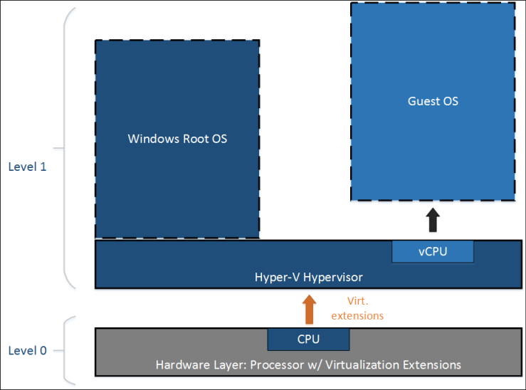
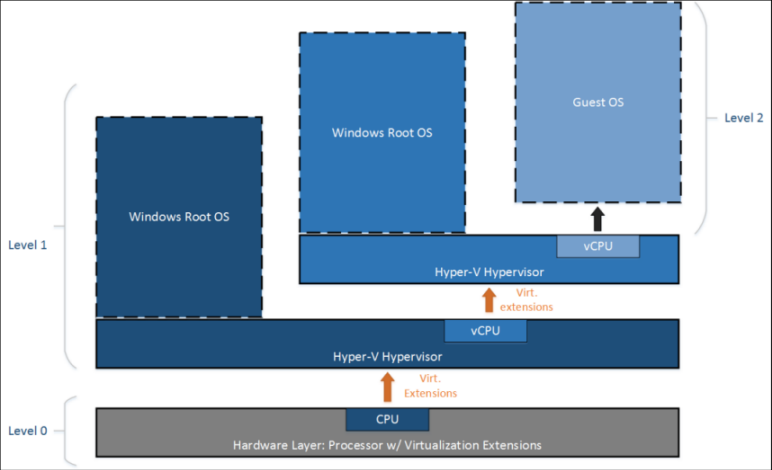

ms.ContentId: a772cbbf-f825-4465-b048-0ca066e4ded7
title: Insiders - Nesting Hyper-V

# Windows Insiders Preview - Nested Virtualization

> **Note:** This feature is only available to Windows Insiders running Build 10565 or later.  
  It is an early preview with no performance or stability guarantees.  
  If you run into issues, check the [FAQ](#FAQandTroubleshooting).

Nested virtualization is running virtualization inside a virtualized environment.  In other words, nesting allows you to run the Hyper-V server role inside a virtual machine.


## Requirements and Known issues
Before enabling nested virtualization, be aware this is a preview.  Do not use nesting in production environments.  

Requirements:
* 4 GB RAM available minimum.  Nested virtualization requires a good amount of memory.
* Both hypervisors need to be the latest Windows Insider build (10565 or greater).  Other hypervisors will not work.  
* This feature is currently Intel-only. Intel VT-x is required.

Below is a list of known issues: 
* Hosts with Device Guard enabled cannot expose virtualization extensions to guests. You must first disable VBS in order to preview nested virtualization.

* Hosts with Virtualization Based Security (VBS) enabled cannot expose virtualization extensions to guests. You must first disable VBS in order to preview nested virtualization.

* Once nested virtualization is enabled in a virtual machine, the following features are no longer compatible with that VM.  
  These actions will either fail, or cause the virtual machine not to start if it is hosting other virtual machines:  
  * Dynamic memory must be OFF. This will prevent the VM from booting.
  * Runtime memory resize will fail.
  * Applying checkpoints to a running VM will fail.
  * Live migration will fail -- in other words, a VM which hosts other VMs cannot be live migrated.
  * Save/restore will fail.
  
  > **Note:** these features still work in the “innermost” guest VM. The restrictions only apply to the first layer VM.

* Once nested virtualization is enabled, MAC spoofing must be enabled in the virtual machine for networking to work in the "innermost" guests.

## Enable nested virtualization

1. Create a virtual machine running the same build as your host -- [instructions here](../quick_start/walkthrough_create_vm.md).

2. Run [this script](https://github.com/Microsoft/Virtualization-Documentation/blob/master/hyperv-tools/Nested/Enable-NestedVm.ps1) as administrator on the Hyper-V host.
  
  In this early preview, nesting comes with a few configuration requirements.  To make things easier, [this PowerShell script](https://github.com/Microsoft/Virtualization-Documentation/blob/master/hyperv-tools/Nested/Enable-NestedVm.ps1) script will check your configuration, change anything which is incorrect, and enable nested virtualization for the specified virtual machine.
  
  ``` PowerShell
  Invoke-WebRequest https://raw.githubusercontent.com/Microsoft/Virtualization-Documentation/master/hyperv-tools/Nested/Enable-NestedVm.ps1 -OutFile ~/Enable-NestedVm.ps1 
  ~/Enable-NestedVm.ps1 -VmName "DemoVM"
  ```

3. Install Hyper-V in the virtual machine.

  ``` PowerShell
  Invoke-Command -VMName "DemoVM" -ScriptBlock { Enable-WindowsOptionalFeature -FeatureName Microsoft-Hyper-V -Online; Restart-Computer }
  ```
  
4. Create nested virtual machines!

## How does nesting work?
Hyper-V relies on hardware virtualization support (e.g. Intel VT-x and AMD-V) to run virtual machines. Typically, once Hyper-V is installed, the hypervisor hides this capability from guest virtual machines.  This prevents guest virtual machines from running Hyper-V server role amoung other hypervisors.

Nested virtualization exposes those hardware virtualization support components to guest virtual machine.

The diagram below shows Hyper-V without nesting.  The Hyper-V hypervisor takes full control of the hardware virtualization extensions (orange arrow), and does not expose them to the guest operating system.



In contrast, the diagram below shows Hyper-V with nesting. In this case, Hyper-V exposes the hardware virtualization extensions to its virtual machines. With nesting enabled, a guest virtual machine can install its own hypervisor and run its own guest VMs.



## FAQ and troubleshooting

### My virtual machine won’t start, what should I do?
1. Make sure dynamic memory is OFF.
2. Run this PowerShell script on your host machine from an elevated prompt.
  
  This script reports whether your host and VMs are configured properly for nested.

  ``` PowerShell
  Invoke-WebRequest https://raw.githubusercontent.com/Microsoft/Virtualization-Documentation/master/hyperv-tools/Nested/Get-NestedVirtStatus.ps1 -OutFile ~/Get-NestedVirtStatus.ps1 
  ~/Get-NestedVirtStatus.ps1
  ```

### Virtual Machine Connection keeps being lost.
If you are using a blank password, this is a known issue.  Please change your password and the issue should be resolved.

### My issue isn't here.
Don't see your issue?  Have feedback?  Contact us.

Report them through the Windows feedback app, the [virtualization forums](https://social.technet.microsoft.com/Forums/windowsserver/En-us/home?forum=winserverhyperv), or through [GitHub](https://github.com/Microsoft/Virtualization-Documentation).