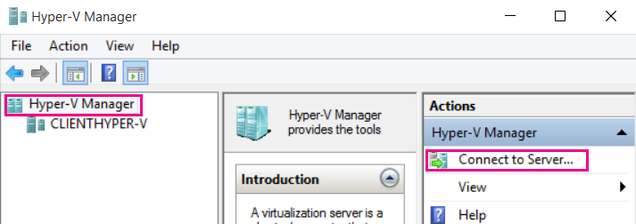
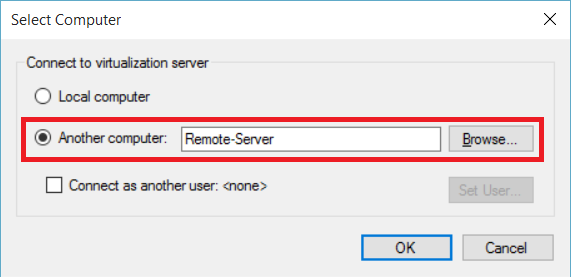

# Manage Remote Hyper-V Hosts with Hyper-V Manager

Hyper-V Manager is an in-box tool for diagnosing and managing your local Hyper-V host and a small number of remote hosts.  This article documents the configuration steps for connecting to Hyper-V hosts using Hyper-V Manager in all supported configurations.

> Hyper-V Manager is available through **Programs and Features** as **Hyper-V Management Tools** on [any Windows OS with Hyper-V included](../quick_start/walkthrough_compatibility.md#OperatingSystemRequirements).  Hyper-V Platform does not need to be enabled in order to manage remote hosts.

To connect to a Hyper-V host in Hyper-V Manager, make sure **Hyper-V Manager** is selected in the left hand pane and then select **Connect to Server...** in the right-hand pane.



## Supported Hyper-V host combinations with Hyper-V Manager
Hyper-V Manager in Windows 10 allows you to manage the following Hyper-V hosts:
* Windows 10
* Windows 8.1
* Windows 8
* Windows Server 2016 + Windows Server Core, Nano Server, and Hyper-V Server
* Windows Server 2012 R2 + Windows Server Core, Datacenter, and Hyper-V Server
* Windows 2012 + Windows Server Core, Datacenter, and Hyper-V Server

Hyper-V Manager in Windows 8.1 and Windows Server 2012 R2 allow you to manage:
* Windows 8.1
* Windows 8
* Windows Server 2012 R2 + Windows Server Core, Datacenter, and Hyper-V Server
* Windows 2012 + Windows Server Core, Datacenter, and Hyper-V Server

Hyper-V Manager in Windows 8 and Windows Server 2012 allow you to manage:
* Windows 8
* Windows 2012 + Windows Server Core, Datacenter, and Hyper-V Server

Hyper-V became available on Windows in Windows 8.  Prior to Windows 8.1/Server 2012, Hyper-V manager only managed matched versions of Hyper-V.

> **Note:** Hyper-V Manager functionality matches the functionality available for version you're managing.  In other words, If you're managing a remote Server 2012 host from Server 2012R2, the new Hyper-V Manager tools from 2012R2 won't be available.

## Manage localhost ##
To add localhost to Hyper-V Manager as a Hyper-V host, select **Local computer** in the **Select Computer** dialogue box.


If a connection can't be established:
*  Make sure the Hyper-V Platform role is enabled.  
  See the [walkthrough section for checking compatibility](../quick_start/walkthrough_compatibility.md) to see if Hyper-V is supported.
*  Confirm that your user account is part of the Hyper-V Administrator group.


## Manage another Hyper-V host in the same domain ##

To add a remote Hyper-V host to Hyper-V Manager, select **Another computer** in the **Select Computer** dialogue box and enter the remote host's hostname, NetBIOS, or FQDN into the text field.



In order to manage remote Hyper-V hosts, remote management must be enabled on both the local computer and remote host.

You can do this through `System Properties -> Remote Management Settings` or by running the following PowerShell command as Administrator:  

``` PowerShell
winrm quickconfig
```

If your current user account matches a Hyper-V Administrator account on the remote host, go ahead and press **OK** to Connect.  

> This is the only supported way to manage a remote host in Hyper-V Manager in Windows 8 or Windows 8.1.


Windows 10 greatly expanded the possible combinations of remote connection types.  
Now you can connect to a remote Windows 10 or later host using either the host name or IP address.  Hyper-V Manager now supports alternate user credentials as well.  


### Connect to the remote host as a different user
> This is only available when connecting to a Windows 10 or Server 2016 Technical Preview 3 or later remote host

In Windows 10, if you are not running with the correct user account for the remote host, you can connect as another user with alternate credentials.

To specify credentials for the remote Hyper-V host, select **Connect as another user: ** in the **Select Computer** dialogue box then select **Set User...**.


### Connect to the remote host using IP address
> This is only available when connecting to a Windows 10 or Server 2016 Technical Preview 3 or later remote host

Sometimes it's easier to connect using IP address rather than host name.  Windows 10 allows you to do just that.

To connect using IP address, enter the IP address into the **Another Computer** text field.


## Manage a Hyper-V host outside your domain (or with no domain) ##
> This is only available when connecting to a Windows 10 or Server 2016 Technical Preview 3 or later remote host

On the Hyper-V Host to be managed, run the following as an administrator:

1.	[Enable-PSRemoting](https://technet.microsoft.com/en-us/library/hh849694.aspx)
  * [Enable-PSRemoting](https://technet.microsoft.com/en-us/library/hh849694.aspx) will create the necessary firewall rules for *private* network zones. To allow this access on public zones you will need to enable the rules for CredSSP and WinRM.
2.  [Enable-WSManCredSSP](https://technet.microsoft.com/en-us/library/hh849872.aspx) -Role server

On the managing PC, run the following as an administrator:

1. Set-Item WSMan:\localhost\Client\TrustedHosts -value "fqdn-of-hyper-v-host"
  * Alternately, you can allow all hosts to be trusted to manage via:
  * Set-Item WSMan:\localhost\Client\TrustedHosts -value * -force
2. [Enable-WSManCredSSP](https://technet.microsoft.com/en-us/library/hh849872.aspx) -Role client -DelegateComputer "fqdn-of-hyper-v-host"
  * Alternately, you can allow all hosts to be trusted to manage via:
  * [Enable-WSManCredSSP](https://technet.microsoft.com/en-us/library/hh849872.aspx) -Role client -DelegateComputer *
3. Additionally you may need to configure the following group policy: ** Computer Configuration | Administrative Templates | System | Credentials Delegation | Allow delegating fresh credentials with NTLM-only server authentication **
    * Click **Enable** and add *wsman/fqdn-of-hyper-v-host*
    * Alternatively, you can allow all hosts to be trusted to manage by adding _wsman/*_
