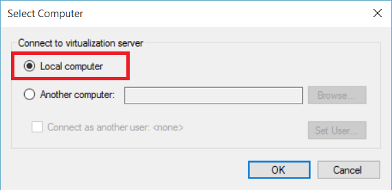
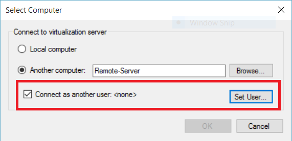

ms.ContentId: 7dcd6da0-dd72-422d-8752-5eccc8116e02
title: Managing remote Hyper-V hosts

# Manage Remote Hyper-V Hosts with Hyper-V Manager #

Hyper-V Manager provides tools for diagnosing and managing your local Hyper-V host and a small number of remote hosts.  This article documents the configuration steps for connecting to Hyper-V hosts using Hyper-V Manager in all supported configurations.

To connect to a Hyper-V host in Hyper-V Manager, make sure **Hyper-V Manager** is selected in the left hand pane and then select **Connect to Server...** in the right-hand pane.


## Manage localhost ##
To add localhost to Hyper-V Manager as a Hyper-V host, select **Local computer** in the **Select Computer** dialogue box.



If a connection can't be established:
*  Make sure the Hyper-V server role is enabled.  See the [walkthrough section for checking compatability](../user_guide/walkthrough_compatability.md).
*  Confirm that your user account is part of the Hyper-V Administrator group.


## Manage a Hyper-V host in your domain ##

To add a remote Hyper-V host to Hyper-V Manager, select **Another computer** in the **Select Computer** dialogue box and enter the remote host's hostname, NetBIOS, or FQDN into the text field.


Windows 10 greatly expanded the possible combinations of remote connection types.  
Now you can connect to a remote Windows 10 or later host using either the host name or IP address.  Hyper-V Manager now supports alternate credentials as well.  

In order to manage remote Hyper-V hosts, remote management must be enabled on both computers.

You can do this through `System Properties -> Remote Management Settings` or by running the following PowerShell command as Administrator:  

``` PowerShell
winrm quickconfig
```

If your current user account matches a Hyper-V Administrator account on the remote host, go ahead and press **OK** to Connect.  

This is the only supported way to manage a remote host in Hyper-V Manager in Windows 8 or Windows 8.1.


### Connect to the remote host as a different user
In Windows 10, if you are not running with the correct user account for the remote host, you can connect as another user with alternate credentials.

To specify credentials for the remote Hyper-V host, select **Connect as another user: ** in the **Select Computer** dialogue box then select **Set User...**.



> Note:  It's very easy to forget to set the user and click OK with user `<none`>.  If your connection fails, make sure you actually did set the user.

### Connect to the remote host using IP address
Sometimes it's easier to connect using IP address rather than host name.  Windows 10 allows your to do just that.

To connect using IP address, enter the IP address into the **Another Computer** text field.


## Manage a Hyper-V host outside your domain (or with no domain) ##
<!--Assuming this isn't done yet...again needs context.-->
Local Hyper-V Host:
1.	Enable-PSRemoting
Came back with netowork set to public.
Ran
Set-NetConnectionProfile -Name "name" -NetworkCategory private
2. Set-Item WSMan:\localhost\Client\TrustedHosts * -Force
3. Enable-WSManCredSSP -Role client -DelegateComputer *

For workgroup only:
1. (should be done) Computer Policy\Administrative Templates\System\Credentials Delegation\Allow Delegating Fresh Credentials → Set to enabled and add WSMAN/* ].  To list of computers, check the box forConcatenate OS defaults with input above

2. Computer Policy\Administrative Templates\System\Credentials Delegation\Allow Delegating Fresh Credentials with NTLM-only server authentication → Set to enabled and add WSMAN/* to list of computers, check the box for Concatenate OS defaults with input above
3. Computer Policy\Administrative Templates\Windows Components\Windows Remote Management (WinRM)\WinRM Client\Allow CredSSP authentication → Set to enabled

Remote Hyper-V Host:
1. Disabled the firewall :)
2. Enable-PSRemoting
3. Set-Item WSMan:\localhost\Client\TrustedHosts * -Force
So that's the demo-only instructions I used.  Replace * and turn off firewall with a single computer and letting credssp and winRM through

## Manage a downlevel host
