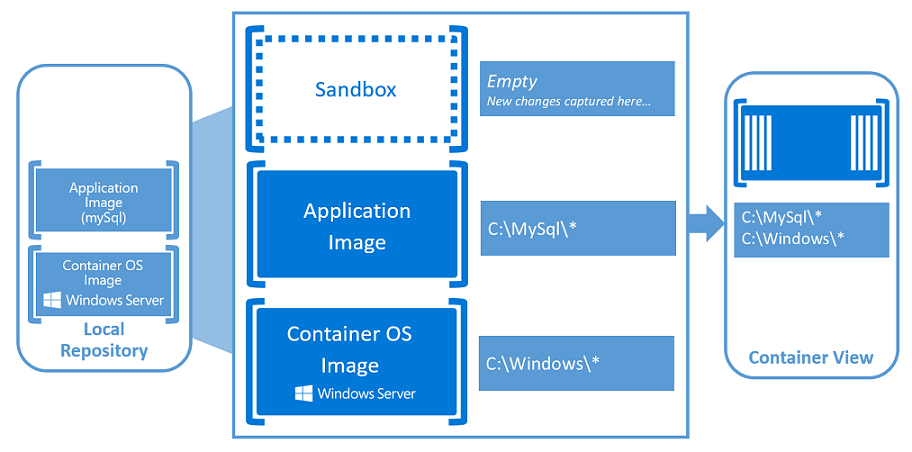

# Windows Containers

Applications fuel innovation in the cloud and mobile era. Containers, and the ecosystem that is developing around them, will empower software developers to create the next generation of applications experiences.

Watch a short overview: [Windows-based containers: Modern app development with enterprise-grade control](https://youtu.be/Ryx3o0rD5lY ).

## What are containers?

They are an isolated, resource controlled, and portable operating environment.

Basically, a container is an isolated place where an application can run without affecting the rest of the system and without the system affecting the application. Containers are the next evolution in virtualization.

If you were inside a container, it would look very much like you were inside a freshly installed physical computer or a virtual machine. And, to [Docker](https://www.docker.com/), a Windows Server Container can be managed in the same way as any other container.

## Container Fundamentals

When you begin working with containers you will notice many similarities between a container and a virtual machine. A container runs an operating system, has a file system and can be accessed over a network just as if it was a physical or virtual computer system. That said, the technology and concepts behind containers are very different from that of virtual machines.  
[This blog post](http://azure.microsoft.com/blog/2015/08/17/containers-docker-windows-and-trends/) by Mark Russinovich explains containers well.

The following key concepts will be helpful as you begin creating and working with Windows Server Containers. 

**Container Host:** Physical or Virtual computer system configured with the Windows Server Container feature. The container host will run one or more Windows Server Containers.

**Container Image:** As modifications are made to a containers file system or registry, such as with software installation they are captured in the sandbox.  In many cases you may want to capture this state such that new containers can be created that inherit these changes. That’s what an image is – once the container has stopped you can either discard that sandbox or you can convert it into a new container image. For example, let’s imagine that you have deployed a container from the Windows Server Core OS image. You then install MySQL into this container. Creating a new image from this container would act as a deployable version of the container. This image would only contain the changes made (MySQL), however would work as a layer on top of the Container OS Image.

**Sandbox:** Once a container has been started, all write actions such as file system modifications, registry modifications or software installations are captured in this ‘sandbox’ layer.  
 
**Container OS Image:** Containers are deployed from images. The container OS image is the first layer in potentially many image layers that make up a container. This image provides the operating system environment. A Container OS Image is Immutable, it cannot be modified.

**Container Repository:** Each time a container image is created the container image and its dependencies are stored in a local repository. These images can be reused many times on the container host. The container images can also be stored in a public or private repository such as DockerHub so that they can be used across many different container host.

**Container Management Technology:** Windows Server Containers can be managed using both PowerShell and Docker. With either one of these tools you can create new containers, container images as well as manage the container lifecycle.

## Containers for Developers

From a developer’s desktop to a testing machine to a set of production machines, a Docker image can be created that will deploy identically across any environment in seconds. This story has created a massive and growing ecosystem of applications packaged in Docker containers, with DockerHub, the public containerized-application registry that Docker maintains, currently publishing more than 180,000 applications in the public community repository.  

When you containerize an app, only the app and the components needed to run the app are combined into an "image". Containers are then created from this image as you need them. You can also use an image as a baseline to create another image, making image creation even faster.  Multiple containers can share the same image, which means containers start very quickly and use fewer resources. For example, you can use containers to spin up light-weight and portable app components – or ‘micro-services’ – for distributed apps and quickly scale each service separately.

Because the container has everything it needs to run your application, they are very portable and can run on any machine that is running Windows Server 2016. You can create and test containers locally, then deploy that same container image to your company's private cloud, public cloud or service provider. The natural agility of Containers supports modern app development patterns in large scale, virtualized and cloud environments.

With containers, developers can build an app in any language. These apps are completely portable and can run anywhere - laptop, desktop, server, private cloud, public cloud or service provider - without any code changes.  

Containers helps developers build and ship higher-quality applications, faster.

## Containers for IT Professionals ##

IT Professionals can use containers to provide standardized environments for their development, QA, and production teams. They no longer have to worry about complex installation and configuration steps. By using containers, systems administrators abstract away differences in OS installations and underlying infrastructure.

Containers help admins create an infrastructure that is simpler to update and maintain.

## Video Overview

<iframe 
src="https://channel9.msdn.com/Blogs/containers/Containers-101-with-Microsoft-and-Docker/player" width="800" height="450" allowFullScreen="true" frameBorder="0" scrolling="no"></iframe>

## Try Windows Server Containers

[Get started with Windows Server Containers in Windows Azure](../quick_start/azure_setup.md)  
[Get started with Windows Server Containers Locally](../quick_start/container_setup.md)
