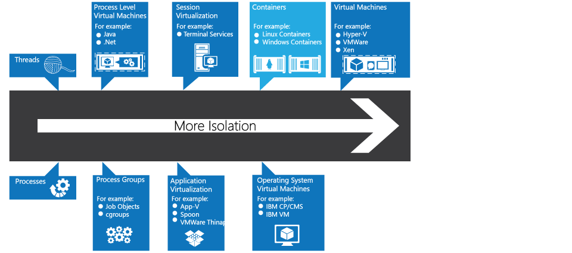

ms.ContentId: 150B8DCC-861B-4FD4-9353-C9886F2F0C30
title: When to use Containers

# When to use Containers #

This article aims to demystify the various technologies that provide isolation in Windows environments.

When should you use containers, AppV, virtual machines, or some combination?  All three provide flexible ways to run workloads in an isolated fashion.

## Overview ##

Each of these technologies provide some level of isolation between your machine and an application, though they differ in isolation level and purpose.

However, there is a price to pay in overhead.  The more isolation from the machine's operating system, the more resources needed.

So really, to understand when to use a container, a VM, or another technology, it's important to consider:
1.  Required security/trust boundaries -- Do you trust the machine and its administrator?
2.  Compatibility and portability (across different systems) -- Does this need to run on different operating systems?  Different versions of the operating system?
3.  Density -- are you running many instances?  If so, do your system resources support that?
4.  Resource management and quality of Service -- do you need to specify resource use?

|  | **Windows Container** | **Virtual Machines** |  **Application Virtualization** |
|:-----|:-----|:-----|:-----|
|Kernel| Same as host | Any (Windows/Linux)| Same as host |
|Multi-tenant security | No | Yes | No |
|Resource managed | Yes | Yes | No |
|Density | High | Lower | Higher |
|Startup time | Short | Longer | Shorter |
|Disk footprint | Small | Larger | Smaller |
|Application compatability | Medium | High | Medium |

## Properties of a container ##
Containers have the following properties:
- Start and stop very fast
- Use small amounts of memory

Windows Containers provide a dynamic isolated execution environment for server grade applications.  By using containers, resources can be isolated, services restricted, and processes provisioned to have a private view of the operating system with their own process ID space, file system structure, and network interfaces. Multiple containers can share the same kernel, but each container can be constrained to only use a defined amount of resources such as CPU, memory and I/O.

Users can create, deploy and run server applications directly inside a container.

## Properties of a virtual machine ##

Virtual machines have the following properties:
- Can run a different operating system than the host
- High level of isolation
- Provide very high availability without requiring application intelligence
- Support for legacy operating systems means support for legacy applications 
- Strong resource management
- Persistent storage

## Properties of App-V ##

By comparison Microsoft Application Virtualization (App-V) is more targeted at desktop applications. It transforms applications into centrally managed services that are never installed and don't conflict with other applications.

In other words, App-V:
- Is targeted at application installation and management
- Users experience is unchanged when an application is virtualized
- Applications communicate with each-other and with traditionally installed applications
- Resource management is provided by the OS
- Applications can leverage any hardware available

You can read more about App-V [here](http://technet.microsoft.com/windows/hh826068.aspx).

## Next steps: ##
**Coming soon**: Get started with your own Windows containers with our [Hello world!](..\quick_start\hello_world.md)