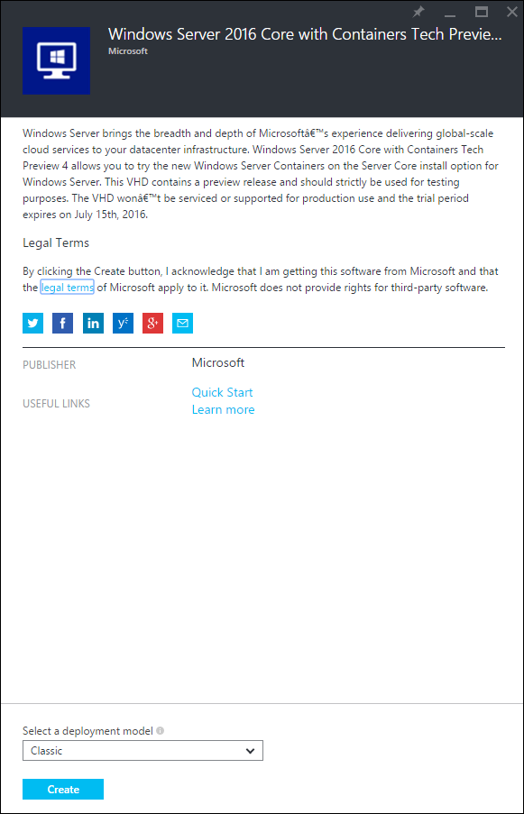
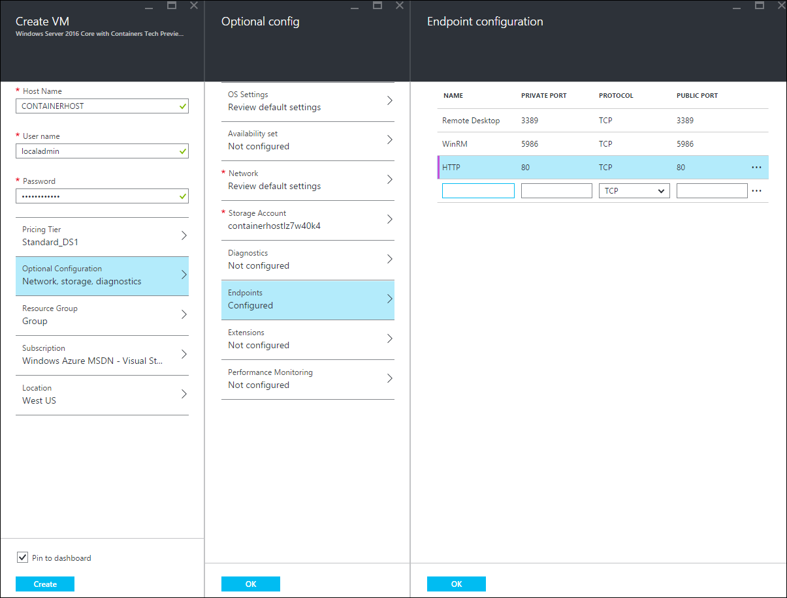
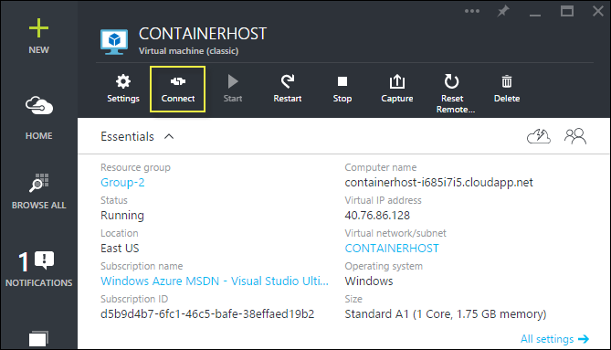

# Azure Quick Start

**This is preliminary content and subject to change.** 

Before creating and managing Windows Server Containers in Azure you will need to deploy a Windows Server 2016 Technical Preview image which has been pre-configured with the Windows Server Containers feature. This guide will walk you through this process.

> Microsoft Azure does not support Hyper-V containers. To complete Hyper-V Container exercises, you need an on-prem container host.

## Start Using Azure Portal
If you have an Azure account, skip to [Create a Container Host VM](#CreateacontainerhostVM).

1. Go to [azure.com](https://azure.com) and follow the steps for an [Azure Free Trial](https://azure.microsoft.com/en-us/pricing/free-trial/).
2. Sign in with your Microsoft account.
3. When your account is ready to go, sign into the [Azure Management Portal](https://portal.azure.com).

## Create a Container Host VM

Search in the Azure Market Place for ‘containers’, this will return ‘Windows Server 2016 Core with Containers Tech Preview 4’


Select the image, and click `create`.



Give the Virtual Machine a name, select a user name and a password.


Select Optional Configuration > Endpoints > and enter an HTTP endpoint with a private and public port of 80 as seen below. When completed click ok two times.



Select the `create` button to start the Virtual Machine deployment process.


When the VM deployment is complete, select the connect button to start an RDP session with the Windows Server Container Host.



Log into the VM using the username and password specified during the VM creation wizard. Once logged in you will be looking at a Windows command prompt.

 

## Update Docker Engine

In order to use `docker pull` with the Azure Windows Container Technical Preview image, the Docker engine needs to be updated. Run the following PowerShell commands on the Azure virtual machine to complete this update.

```powershell
PS C:\> wget https://raw.githubusercontent.com/Microsoft/Virtualization-Documentation/live/windows-server-container-tools/Update-ContainerHost/Update-ContainerHost.ps1 -OutFile Update-ContainerHost.ps1

PS C:\> ./Update-ContainerHost.ps1
``` 

## Video Walkthrough

<iframe src="https://channel9.msdn.com/Blogs/containers/Quick-Start-Configure-Windows-Server-Containers-in-Microsoft-Azure/player" width="800" height="450"  allowFullScreen="true" frameBorder="0" scrolling="no"></iframe>


## Next Steps: Start Using Containers

Now that you have a Windows Server 2016 system running the Windows Server Container feature, jump to the following guides to begin working with Windows Server Containers and Windows Server Container images. 

[Quick Start: Windows Containers and Docker](../quick_start/manage_docker.md)