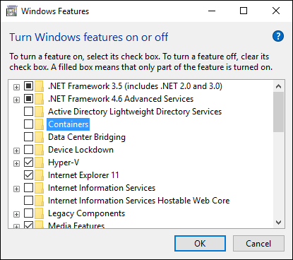
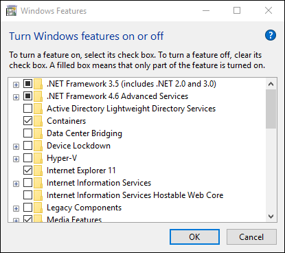

# Container Host Deployment – Windows 10

**This is preliminary content and subject to change.** 

The Windows container feature is available in Windows 10 insider releases. Windows containers on Windows 10 only support the Hyper-V container runtime, and the Nano Server base OS image. Follow the steps in this article to configure the feature. 

## Deploy Containers - PowerShell

### Install container feature <!--1-->

To enable the container feature using PowerShell, run the following command in an elevated PowerShell session.

```none
Enable-WindowsOptionalFeature -Online -FeatureName containers –All
```

### Install Hyper-V feature <!--1-->

Because Windows 10 only supports Hyper-V containers, the Hyper-V feature must be enabled. To enable the Hyper-V feature using PowerShell, run the following command in an elevated PowerShell session.

```none
Enable-WindowsOptionalFeature -Online -FeatureName Microsoft-Hyper-V –All
```

## Deploy Containers - Wizard

### Install container feature <!--2-->

To enable the container feature using the 'Turn Windows feature on or off' wizard, select the ‘Containers’ feature from the list and follow the dialog prompts.



### Install Hyper-V feature <!--2-->

To enable the container feature using the 'Turn Windows feature on or off' wizard, select the ‘Hyper-V’ feature from the list and follow the dialog prompts.



## <a name=img></a>Install OS images

A base OS image is used as the base to any Hyper-V container. The container feature on Windows 10 supports the Nano Server base OS image. This can be installed using the Container Provider PowerShell module.   

The following command can be used to install the Container Provider PowerShell module.

```none
Install-PackageProvider ContainerImage -Force
```

Use `Find-ContainerImage` to return a list of images.

```none
Find-ContainerImage
```

Which will output something similar to this.

```none
Name                 Version                 Description
----                 -------                 -----------
NanoServer           10.0.10586.0            Container OS Image of Windows Server 2016 Techn...
WindowsServerCore    10.0.10586.0            Container OS Image of Windows Server 2016 Techn...

```
To download and install the Nano Server base OS image, run the following.

```none
Install-ContainerImage -Name NanoServer
```

For more information on Container image management see [Windows container images](../management/manage_images.md).
 
## <a name=docker></a>Install Docker

A script has been created to install and configure the Docker service. Run the following commands to download the script

```none
Invoke-WebRequest https://aka.ms/tp5/Update-Container-Host -OutFile update-containerhost.ps1
```
Run the script to install the Docker service.

```none
.\update-containerhost.ps1
```
For manual installation and configuration steps, see [Docker and Windows](./docker_windows.md).
