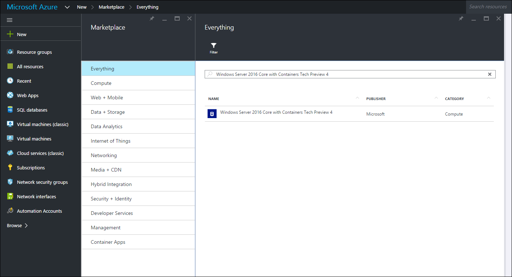
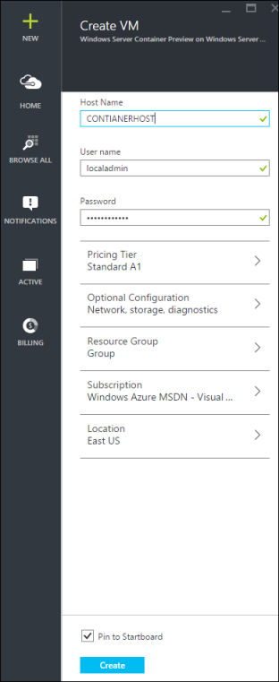
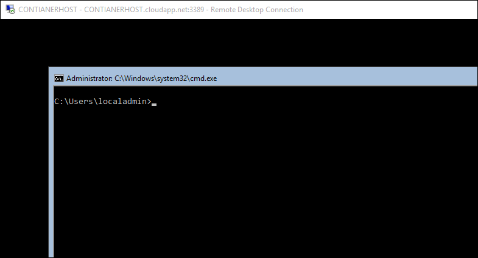

ms.ContentId: 1ab7bfe1-da35-4ff1-916f-936fedf536a0
title: Setup Windows Containers in Azure

# Preparing Microsoft Azure for Windows Containers

Before creating and managing Windows Server Containers in Azure you will need to deploy a Windows Server 2016 Technical Preview image which has been pre-configured with the Windows Server Containers feature. This guide will walk you through this process.

To run Windows Server Containers in a Hyper-V virtual machine instead, follow [these instructions](./container_setup.md).

## Start Using Azure Portal
If you have an Azure account, skip straight to [Create a Container Host VM](#CreateacontainerhostVM).

1. Go to [azure.com](https://azure.com) and follow the steps for an [Azure Free Trial](https://azure.microsoft.com/en-us/pricing/free-trial/).
2. Sign in with your Microsoft account.
3. When your account is ready to go, sign into the [Azure Management Portal](https://portal.azure.com).

## Create a Container Host VM

Click on the following link to start the VM creation process – [New Windows Server Container Host in Azure]( https://portal.azure.com/#gallery/Microsoft.WindowsServer2016TechnicalPreviewwithContainers). 

You can also search for the image in the Azure gallery.

Click on the `create` button.

Give the Virtual Machine a name, select a user name and a password.

Select Optional Configuration > Endpoints > and enter an HTTP endpoint with a private and public port of 80 as seen below. When completed click ok two times.

Select the `create` button to start the Virtual Machine deployment process.

When the VM deployment is complete, select the connect button to start an RDP session with the Windows Server Container Host.

Log into the VM using the username and password specified during the VM creation wizard. Once logged in you will be looking at a Windows command prompt.

 

## Next Steps - Start Using Containers

Now that you have a Windows Server 2016 system running the Windows Server Container feature jump to the following guides to begin working with Windows Server Containers and Windows Server Container images. 

[Quick Start: Windows Server Containers and PowerShell](./manage_powershell.md)  
[Quick Start: Windows Server Containers and Docker](./manage_docker.md)

-------------------
[Back to Container Home](../containers_welcome.md)  
[Known Issues for Current Release](../about/work_in_progress.md)